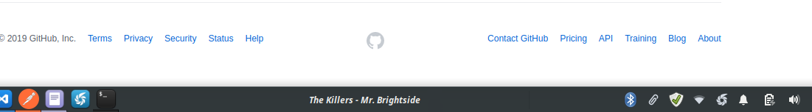

# XFCE Spotify Plugin
## Note: this is a fork of https://github.com/macr1408/XFCE-Spotify-Plugin, modified to use playerctl instead of the Spotify Web API

This plugin integrates Spotify's Now Playing feature with XFCE Panel.

## Features

- Shows the current song playing.
- If you hover over the name, you will see the album
- If you click the name, you will be redirected to the Spotify song in the browser.

## What are the requirements for this?

- XFCE
- [XFCE Plugin: Genmon (Generic Monitor)](https://goodies.xfce.org/projects/panel-plugins/xfce4-genmon-plugin)
- [playerctl (for getting spotify metadata)](https://github.com/altdesktop/playerctl)
- Jq (sudo apt install jq)
- CURL

For Linux Mint, you can download Genmon from the software manager.

## Installation

### Install playerctl (https://github.com/altdesktop/playerctl)
#### Refer to https://github.com/altdesktop/playerctl#installing for installation.

### Installing this plugin
1. Download/clone this repo to somewhere you want the program to live
2. Cd into the folder that was downloaded, then make `xfce-spotify-main.sh` executable: `cd XFCE-Spotify-Plugin && chmod +x xfce-spotify-main.sh`
3. Create a "Generic Monitor" item on your panel
4. Edit properties of this "Generic Monitor" item to execute the file xfce-spotify-main.sh, hide the label *(or don't, it's up to you lol)*, and set a period of 10 seconds
5. Enjoy!

## F.A.Q

### **Can I change the format (ex. Artist - Song Title)?**

Yes. You can edit `OUTFORMAT` in config.sh.

### **Does this plugin show real time info?**

*Technically* it doesn't, but it refreshes every 10 seconds (you can even lower down this number in the genmo settings) so it emulates being in real time

### **But I want real time info about the current playing song, I will lower down the refresh time to 1 second...**

Sure, go for it! Since we're getting the song data locally, we are not limited to how often we can get it. However, keep in mind that you will be setting a command to run every X seconds, so try to set this value to something sensible.

## Credits

- Genmo for making this possible and very easy to code, you are awesome!
- All the StackOverflow community with their answers
- [macr1408](https://github.com/macr1408) for original code, [userbyte](https://github.com/userbyte) for modifications to use playerctl instead of SpotifyAPI